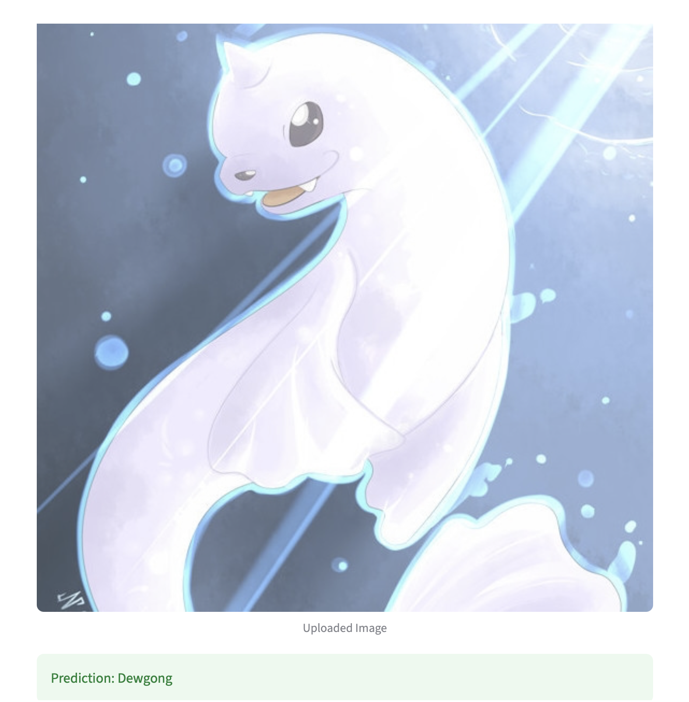
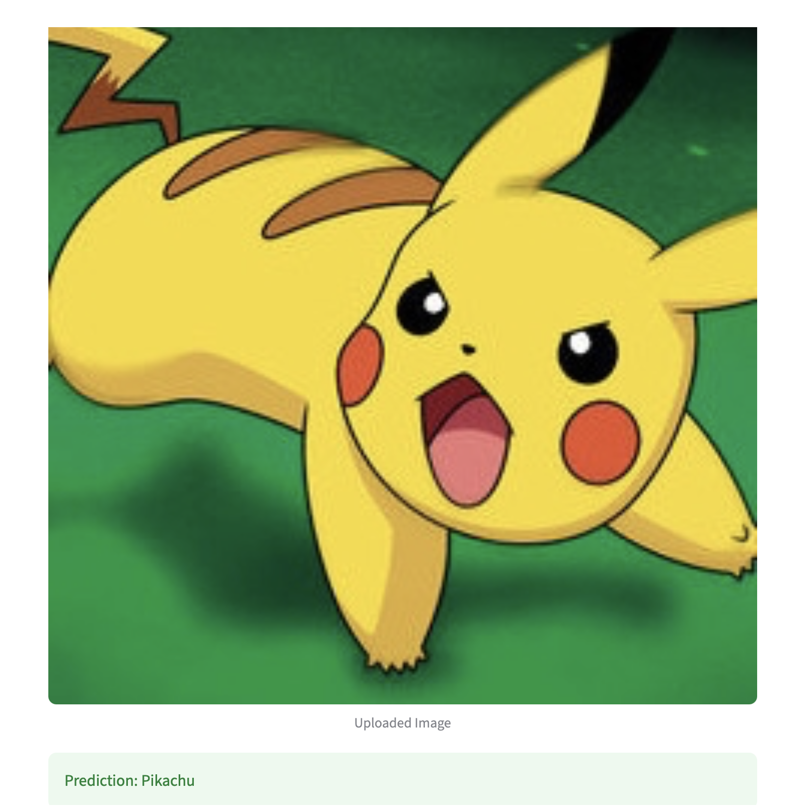

# pokemon_image_classifier
A Pokemon image classification project using PyTorch and transfer learning to predict Pokemon names from images.

---

## Project Objective

The goal of this project is to:
- Classify Pokémon images into **150 different classes**
- Build and compare multiple deep learning classifiers
- Evaluate model performance using:
  - Accuracy
  - Precision
  - Recall
- Deploy a simple **web-based demo application**

---

## Dataset

- Source: Kaggle Pokémon Dataset
- Total Images: ~7,000
- Number of Classes: 150 Pokémon categories

Each class contains labeled Pokémon images used for supervised learning.(provided by Professor) 

**ResNet18 (Transfer Learning)** from PyTorch torchvision is used.
Key features:
- Pretrained ImageNet weights (optional experiment)
- Fine-tuned fully connected layer
- Input image size: 224 × 224
- Loss function: CrossEntropyLoss
- Optimizer: Adam

## Experimental Results

| Experiment | Pretrained | Freeze | Learning Rate | Epochs | Accuracy |
|------------|------------|--------|---------------|--------|----------|
| Exp 1 | False | False | 0.001 | 5 | 0.28 |
| Exp 2 | True  | True  | 0.001 | 5 | 0.77 |
| Exp 3 | True  | False | 0.001 | 5 | 0.84 |
| Exp 4 | True  | False | 0.0005 | 10 | 0.95 |

### Key Observation

- Experiment 1 (no pretraining) performed poorly, showing that training from scratch is not effective for this dataset.
- Experiment 2 (frozen pretrained model) significantly improved performance.
- Experiment 3 (fine-tuning without freezing) further improved accuracy.
- Experiment 4 (lower learning rate + more epochs) achieved the best performance with **0.95 accuracy**, showing that careful fine-tuning leads to optimal results.

## 🖥️ Demo Output

Here are example predictions from the trained model using the Streamlit interface.

<p align="center">
  
  
  
</p>

## 📁 Project Structure
Assignment6/
_PokemonData
_src/
 _dataset.py # Data loading & preprocessing
 _model.py # ResNet18 model definition
 _train.py # Model training script
 _predict.py # Command-line prediction script
_app.py # Streamlit demo application
_model.pth # Trained model weights
_predict1.jpg 
_predict2.jpg 
_predict3.jpg 

## 🚀 How to Run the Project

### Install dependencies
```bash
pip install -r requirements.txt
```
### Train the model
```bash
python src/train.py
```
### Run Streamlit app
```bash
streamlit run app.py
```


